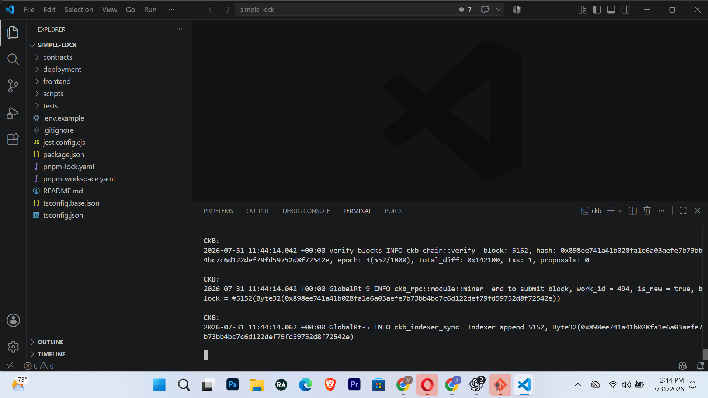
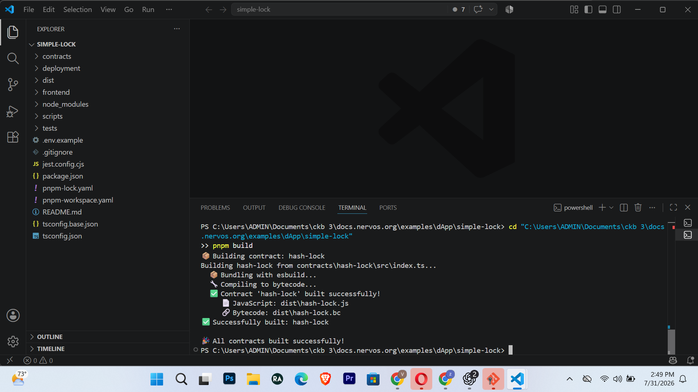
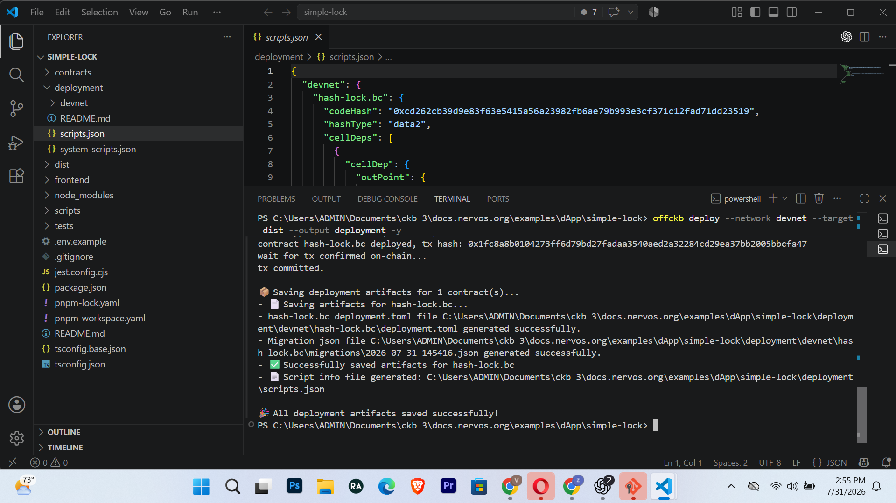
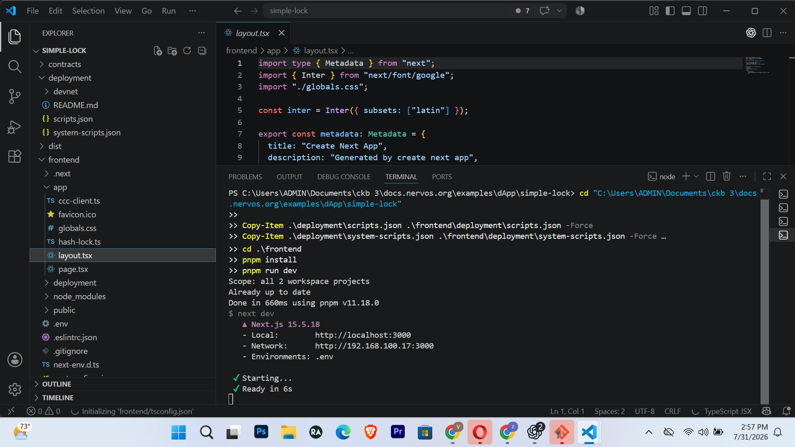
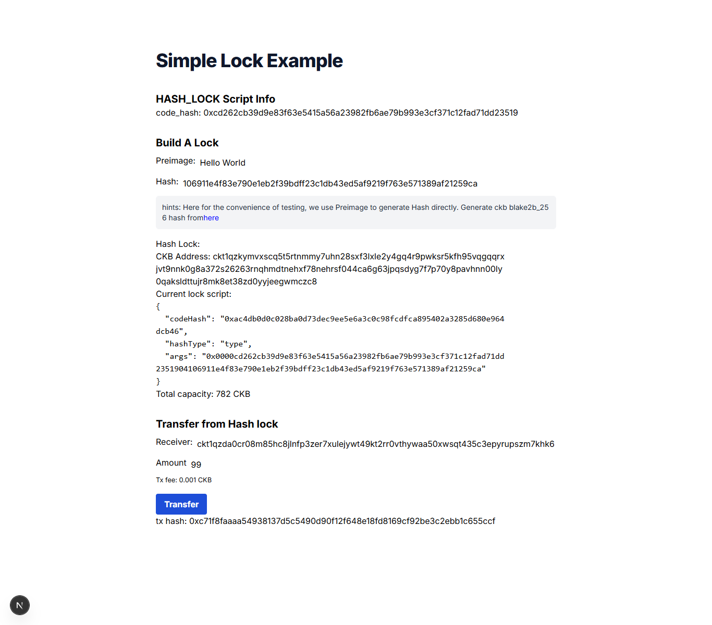
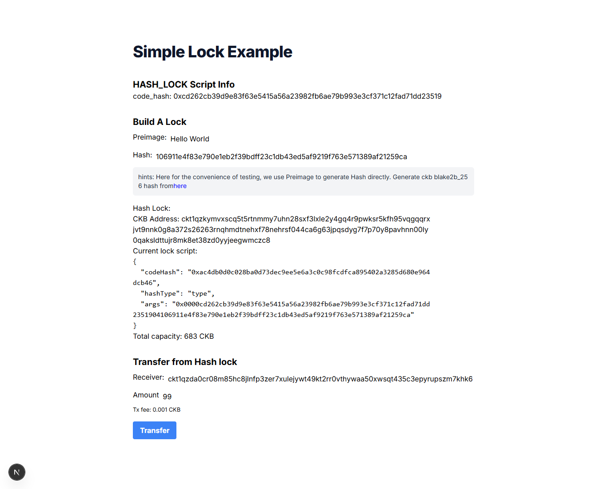

# Proofs

This page lists the evidence for the campaign requirements.

## Requirement Checklist

| Requirement | Status | Evidence |
|---|---:|---|
| OffCKB running locally | Done | `01-offckb-devnet-running.png` |
| Custom lock script built | Done | `02-contract-build-success.png` |
| Custom lock script deployed | Done | `03-lock-script-deployed.png`, `proofs/deployment/scripts.json` |
| dApp frontend running | Done | `04-frontend-running.png` |
| CKB deposited into hash-lock address | Done | `05-deposit-balance.png`, `deposit-proof.txt` |
| CKB unlocked/transferred from hash-lock via frontend | Done | `06-frontend-unlock-success.png`, `frontend-unlock-proof.txt` |
| Final balance changed after unlock | Done | `07-final-balance-after-unlock.png` |

## Transaction Details

### Custom Lock Deployment

```text
Contract: hash-lock.bc
Code hash: 0xcd262cb39d9e83f63e5415a56a23982fb6ae79b993e3cf371c12fad71dd23519
Hash type: data2
Deployment tx: 0x1fc8a8b0104273ff6d79bd27fadaa3540aed2a32284cd29ea37bb2005bbcfa47
```

### Deposit

```text
Deposit tx: 0x9f7e06e886aafc5232406e4fafdb5f2eca964d549c7fcf72dbd67d377a44285c
Hash-lock balance after deposit: 881.99995 CKB
Balance shown in dApp: 881 CKB
```

### Frontend Unlock

```text
Frontend unlock tx: 0xc71f8faaaa54938137d5c5490d90f12f648e18fd8169cf92be3c2ebb1c655ccf
Receiver: ckt1qzda0cr08m85hc8jlnfp3zer7xulejywt49kt2rr0vthywaa50xwsqt435c3epyrupszm7khk6weq5lrlyt52lg48ucew
Amount: 99 CKB
Preimage used: Hello World
Final hash-lock balance: 683.99993 CKB
Balance shown in dApp: 683 CKB
```

## Screenshots

### 1. OffCKB Devnet Running



### 2. Contract Build Success



### 3. Lock Script Deployed



### 4. Frontend Running



### 5. Deposit Balance


### 6. Frontend Unlock Success



### 7. Final Balance After Unlock


